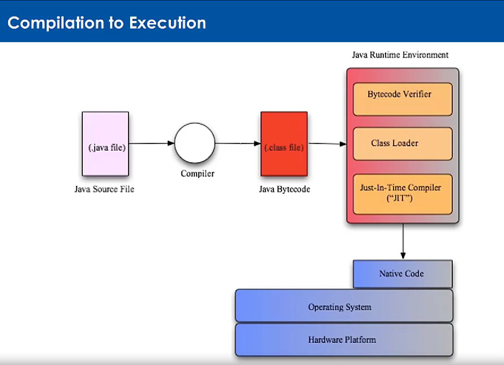

# Introduction to Java

Beneficios de Java:

Hay 3 ediciones de Java:

-Java standard Edition(SE)

-Java Enterprise Edition(EE)

-Java Micro-Edition(ME)

Beneficio principales de java:

-escribir una vez, ejecutarlo en donde sea.

-Desarrollar object orientation soluciones

-Programar en un sintaxis familiar a C++

-La variedad de tener una vasta cantidad de librerias

-Seguridad predeterminada

-Soporte internacional

-Alto rendimiento

-Es gratis de usar

-Una comunidad que continua mejorando el motor de java

**Escribir una vez, ejecutarlo donde sea:**

Intel, arm, Windows, Mac OS X, Linux,etc

Java funciona en cualquier máquina porque se ejecuta en su propio ambiente simulado, una Máquina Virtual de Java(JVM en inglés)

El código es compilado en un formato intermedio llamado achitecture-neurtal bytecode que hace parte de JVM specification.

es el JVM en renderizador,(runtimeJRE Java Runtime Environment) el que traduce las instrucciones neutrales en código nativo entendible por la máquina o equipo físico en que se ejecuta. Al comienzo ese código será interpretado y no compilado porque hacer compilación es bastante intensivo para renderizar el código de algun aplicación en java, pero el JVM intentará optimizar el código nativo que ha sido traducido desde el código inicial de java que se haya escrito previamente para aumentar la velocidad de carga del código entre más se ejecute el código.

Los _bytecodes_ son un código intermedio de java entre lenguaje de máquina nativo y lenguaje de alto nivel, y java los usa como puente intermedio para traducir o 'interpretar', el código que fue escrito en java para luego de ser interpretado a _bytecode_ formato, facilitar su conversión a código nativo de máquina mediante el compilador JIT(Just In Time).

-**Una aplicación Java es instalada en una máquina virtual de java(Java virtual Machine JVM)**

-**El código es compilado en un 'formato intermedio' llamado _arquitectura neutral bytecodes_**

-**Los desarrolladores escriben código para la plataforma Java en vez de cualquier otra plataforma específica**

-**Los _bytecodes_ son renderizados o ejecutados por la máquina virtual de java(JVM) y las instrucciones del _bytecode_ son traducidas a código de máquina nativo por el ambiente de ejecución java(Java Runtime Environment JRE) más específicamente mediante JIT(Just In Time compiler)**

El método WORA(Write Once, Run Everywhere) que en español significa, escibe una vez, ejecuta donde sea, permite que cualquier código java sea compilado por la JVM(Java Virtual Machine) y renderizado(ejecutado) en cualquier JRE(Java Run Environment), de esta manera cualquier dispositivo que tenga una correcta versión de JRE instalado tiene la capacidad de renderizar o ejectuar programas escritos en java.
Sin embargo es de tener en cuenta que el método WORA, no aisla por completo el motor de java de la máquina.  

## Paquetes, sintaxis, y librerías

 Los paquetes son directorios en donde se guardan todas las clases contenidas en cada directorio, tal como en un computador un directorio es una direccion en donde se guardan archivos o carpetas que en este caso serían las clases.   
Sin embargo, a diferencia de los directorios de un computador que son hechos para ser leidos en solo una plataforma(la del computador), java utiliza los packages para poder analizar y leer archivos o carpetas(clases) de una manera mas neutral, para poder así ser multiplataforma.   
en un directorio de un archivo se usa generalmente los slashes('/'), en java se usan los puntos('.') para poder separar cada contenedor de archivos en el enlace del directorio. ejm:    
 

`package com.learnquest.calculator.util;`    

los paquetes ayudan a ordenar las clases(o carpetas, archivos), de manera más entendible y a evitar colisiones de nombres de clases(_name colisions_), pues podría confundirse algun nombre dentro de los archivos que también esté de igual manera refiriendose a otro archivo pero del sistema de la máquina en la que esté operando java. 
Además tener en cuenta que el nomre de la ruta del paquete siempre debe ser al revés tal y como se mostró en el ejemplo anterior.

## Sintaxis familiar de C/C++
